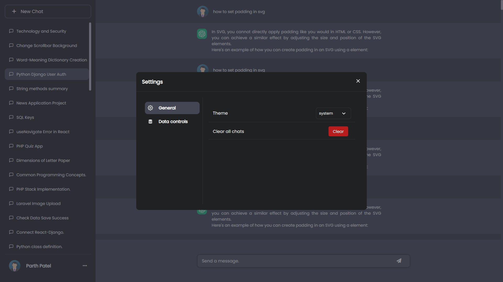
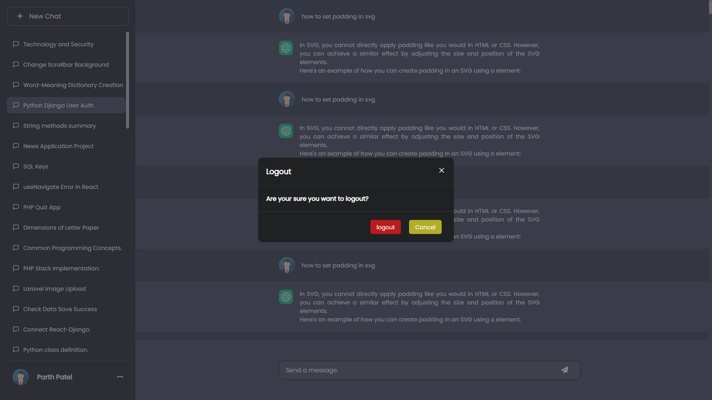

# Chat GPT Clone

Hello Friends,

This repository is create chatGPT clone with reponsive website using html css and javascript.

The ChatGPT Clone UI plays a crucial role in providing an interactive and user-friendly interface for users to engage in conversations with the ChatGPT clone. 

It allows users to input their queries, view system responses, and interact seamlessly with the conversational AI system. 

Here are some key aspects and considerations for the ChatGPT Clone UI:

1. Simplicity

2. User - friendly

3. Responsive

## 🛠 Technologies
1. HTML
2. CSS
3. Javascript

## Outputs

1. First page in introduction chatGPT

2. Second image is user all chats 

3. Third image is User Settings Modal  

4. Forth image is Logout Modal  

# Thank You 😀😀😀
